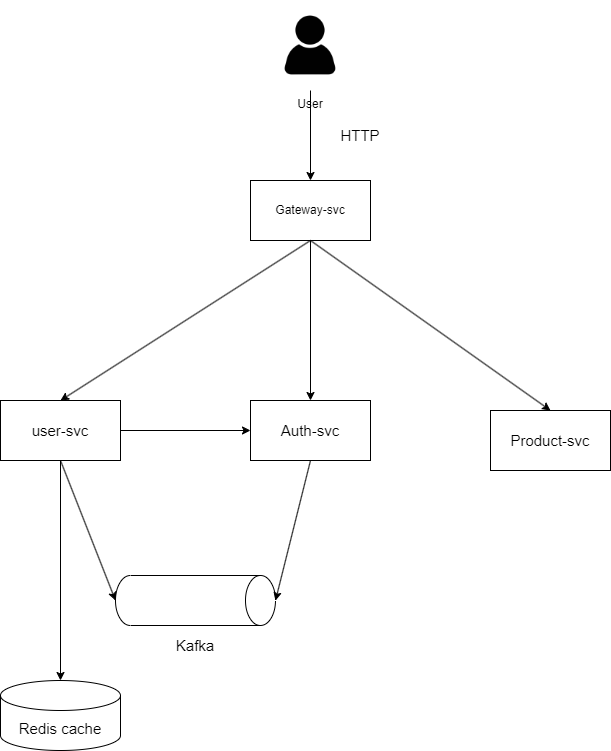

YAMP—Yet Another Microservice Project
# Introduction
## Project Overview:
- This e-commerce cloud-based microservice project is designed for learning purposes, with a strong emphasis on microservices architecture and its associated concerns. Key areas of focus include:
    - Service Discovery
    - Load Balancing
    - Fault Tolerance
    - Distributed Tracing, Distributed transaction
    - Monitoring
    -  and more

- Given my interest in DevOps, I’ve also integrated several DevOps practices into the project, such as
  CI/CD Pipeline
  Containerization
  Orchestration
  Monitoring
  Logging
  also
- I write about Unit test and integration test for integrated with CI/CD pipeline

While the project is still evolving and currently lacks some business logic and features, I am committed to continuously adding more functionalities in the future.

# Current Architecture


# Tech stack
## **Java Backend**: Spring Framework
- **Spring Boot**:
- **Spring Cloud**: Spring Cloud gateway
- **Spring Security**: Spring Resource Server, Spring Authorization Server
- **Spring Data JPA**: Spring Data Redis, Spring Data PostgresSQL
- **Cache**: Redis
- **Database**: PostgresSQL
- [x] **Distributed session management**: Spring Session and Redis
- [x] **Distributed caching**: Redis

## **Monitoring and Observability**: 
- [x] **Metrics exporter**: Micrometer cooperating with Actuator
- [x] **Distributed tracing**: OpenTelemetry, Tempo and Grafana
- **I'm currently working on these features**
    - [ ] **Distributed logging aggregation**: Loki and Alloy
    - [ ]  **Visualization all these metrics**: Grafana


- [x] **Authentication and Authorization**: Using Spring Security, Oauth 2.0, Jwt

# How to develop this project
## **Prerequisites**
- **Java 17** 
- **Maven 3.8.1**
## **How to develop**
- **Clone this repository**
- **Cd to the root directory of the project**
- **First install the parent pom of this project in your local repository**
```mvn clean install -N``` 
- **Wait for the process to finish**
- **You can start developing now**
# Devops tools
- **CI/CD**:
    - CI: GitHub Actions
- **Containerization**: Docker
- **Orchestration**: Kubernetes
- **Delivery tool for deploying app on Kubernetes**: ArgoCD, Helm chart
- **Logging Aggregation**: Loki
- **Monitoring**: Prometheus
- **Visualization**: Grafana

In the future, we have Terraform and Ansible
For more information about the Pipeline, please refer to the [readme.md](./workflows/readme.md)

For more information about how I deploy this project, please refer to the [deployment repository](https://github.com/ngodat0103/yamp-deployment.git)

