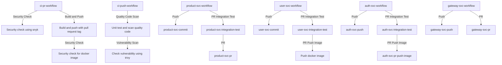

# Overview

I have create a CI/CD pipeline with doing the following:
- Build the project -> 
Run the unit test -> 
Run the integration test -> 
Build the docker image -> 
Push the docker image to the docker registry ->
Update the deployment repository with the new image tag ->
Deploy the application to the Kubernetes cluster
- Support caching, Security scanning, quality check
- Template for PR and Push

## WorkFlow push

## Deploying workflow

## Caching

## Code quality (SonarQube), failed because I'm not write full test for the project yet :((

## Snyk Security scanning,vulnerability check

# **For more detail about how I deploy this repo in Kubernetes, please refer to the [deployment repository](https://github.com/ngodat0103/yamp-deployment.git)** 
