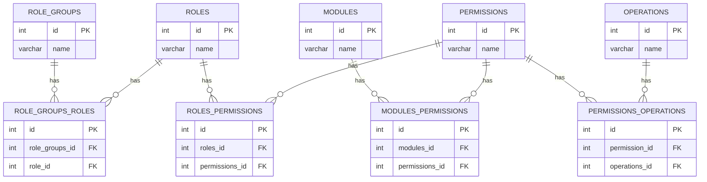

# auth-svc

An authorization service responsible for user authentication, authorization, and user management.

## Table of Contents
- [Technologies Used](#technologies-used)
- [Architecture Overview](#architecture-overview)
- [Entity-Relationship Diagram (ERD)](#entity-relationship-diagram-erd)
- [Setup and Installation](#setup-and-installation)
- [Running the Project](#running-the-project)
- [API Endpoints and Flow](#api-endpoints-and-flow)
- [Contribution Guidelines](#contribution-guidelines)
- [License](#license)

## Technologies Used

- Java 17
- Spring Boot 3.1.2
- Spring Cloud 2023.0.3
- Spring Data JPA 3.1.2
- Spring Security 6.1.2
- Spring Session 3.1.2
- Spring OAuth2 Authorization Server 1.1.2
- PostgreSQL 42.6.0
- Redis
- Kafka
- Micrometer 1.11.2
- OpenTelemetry 1.33.5
- MapStruct 1.5.5.Final
- Lombok
- Springdoc OpenAPI 2.6.0
- Testcontainers 1.20.1
- JUnit Jupiter 5.10.0
- Mockito 5.3.1
- AssertJ 3.24.2
- Nimbus JOSE + JWK 9.31

## Architecture Overview

The project follows a layered architecture with clear separation of concerns:
- **Controller Layer**: Handles incoming HTTP requests and maps them to the appropriate service methods.
- **Service Layer**: Contains business logic and interacts with the persistence layer.
- **Persistence Layer**: Manages database interactions using Spring Data JPA.
- **Security Layer**: Manages authentication and authorization using Spring Security and OAuth2.
- **Event Layer**: Handles asynchronous communication using Kafka.

## Entity-Relationship Diagram (ERD)
**For more information, check the [RBAC in microservices](https://elang2.github.io/myblog/posts/2018-09-29-Role-Based-Access-Control-MicroServices.html)**



## Setup and Installation

1. **Install Java Development Kit (JDK) 17**: Ensure you have JDK 17 installed on your system.
2. **Install and Configure PostgreSQL**: Install PostgreSQL and create a database for the application. Update the `application.yml` file with the database connection details.
3. **Install and Configure Redis**: Install Redis and update the `application.yml` file with the Redis connection details.
4. **Install and Configure Kafka**: Install Kafka and update the `application.yml` file with the Kafka bootstrap servers.
5. **Set up the Project**: Clone the project from the repository and import it into your IDE.

## Running the Project

### Prerequisites

1. **Start PostgreSQL**: Ensure PostgreSQL is running and the database is accessible.
2. **Start Redis**: Start the Redis server.
3. **Start Kafka**: Start the Kafka server and create the required topics.

### Execution Instructions

- **Using Maven**:
```shell
./mvnw spring-boot:run
```
This command will build the project, resolve dependencies, and start the application.

## API Endpoints and Flow

## License

This project is licensed under the Apache License 2.0.
