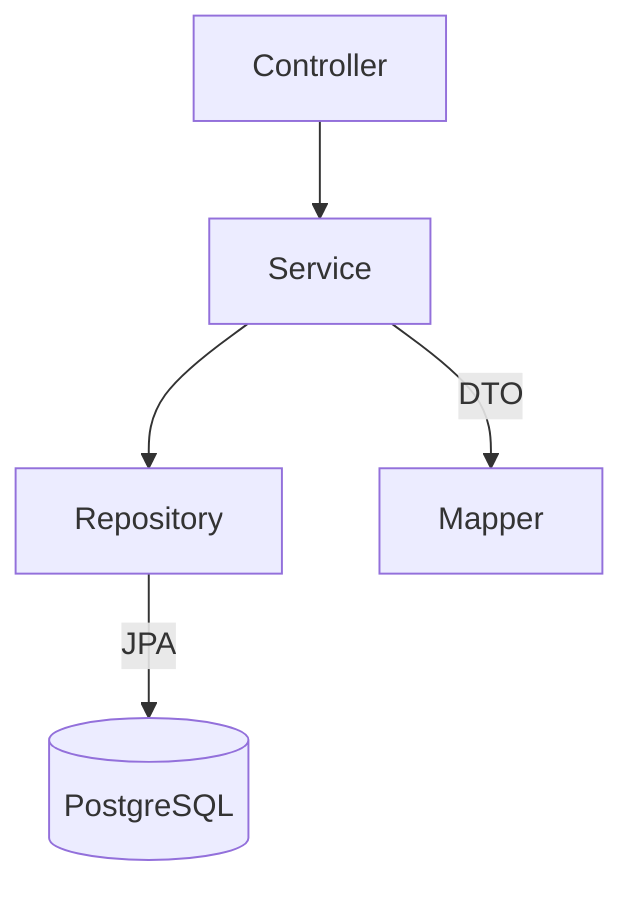
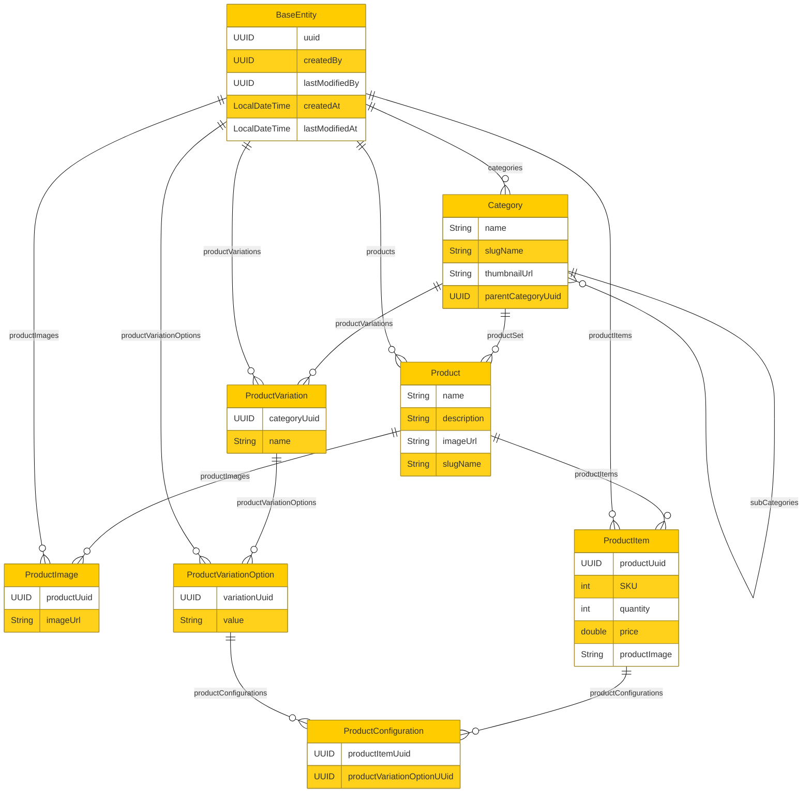
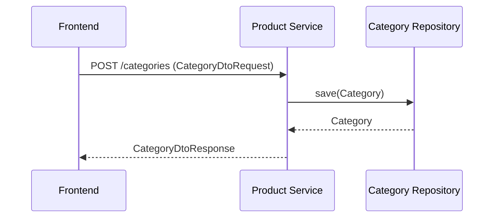
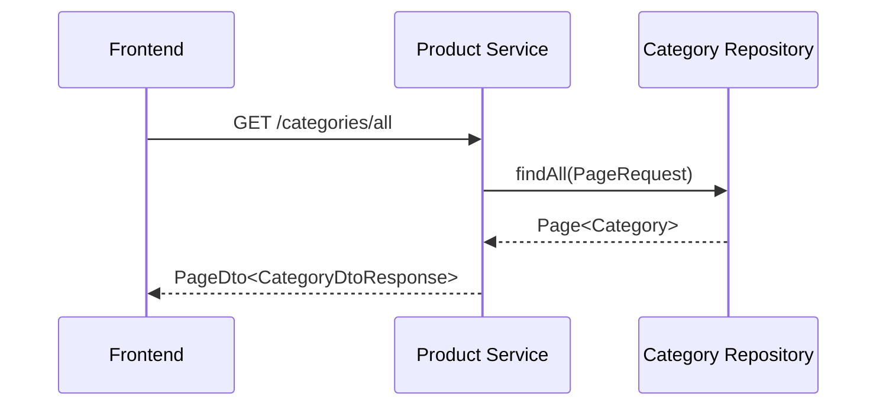
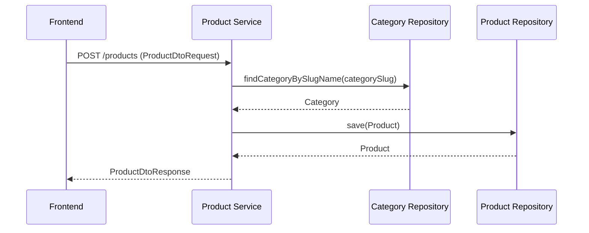

# Product Service

## Overview
The Product Service is a Spring Boot application designed to manage products and categories. It provides RESTful APIs for creating, reading, updating, and deleting products and categories. The service is built using Java 17 and integrates with PostgreSQL for data persistence.

## Technologies
- Java 17
- Spring Boot 3.3.1
- Spring Cloud 2023.0.3
- Spring Data JPA 3.3.1
- PostgreSQL 42.7.3
- AWS SDK for Java (S3) 2.20.0
- MapStruct 1.5.5.Final
- Springdoc OpenAPI 2.6.0
- Micrometer Prometheus 3.3.1
- Spring Boot Actuator 3.3.1
- Spring Boot Validation 3.3.1
- Slugify 3.0.7
- OpenTelemetry Java Agent 1.33.5
- Spring HATEOAS 3.3.1
- Spring Boot OAuth2 Resource Server 3.3.1
- Spring Security Test 6.3.2
- Spring Web 6.1.13
- Spring Web MVC 6.1.13
- Spring Security Config 6.3.2
- Lombok 1.18.30

## Architecture
The application follows a layered architecture with the following components:
- **Controller**: Handles incoming HTTP requests and returns responses.
- **Service**: Contains business logic and interacts with repositories.
- **Repository**: Interfaces with the database using Spring Data JPA.
- **DTO**: Data Transfer Objects for transferring data between layers.
- **Mapper**: Maps between entities and DTOs using MapStruct.



## Entity-Relationship Diagram (ERD)
The ERD below represents the relationships between the main entities in the database.



## How to Run
1. **Install Prerequisites**:
   - Java Development Kit (JDK) 17
   - Maven
   - PostgreSQL

2. **Set Up Database**:
   - Create a PostgreSQL database for the project.

3. **Configure Environment Variables**:
   - `SPRING_DATASOURCE_URL`: JDBC URL for the PostgreSQL database.
   - `SPRING_DATASOURCE_USERNAME`: Username for the database.
   - `SPRING_DATASOURCE_PASSWORD`: Password for the database.

4. **Run the Application**:
   ```shell
   mvn spring-boot:run
   ```

## API Flows
### Create Category


### Get All Categories


### Create Product


## License
This project is licensed under the MIT License - see the LICENSE file for details.
