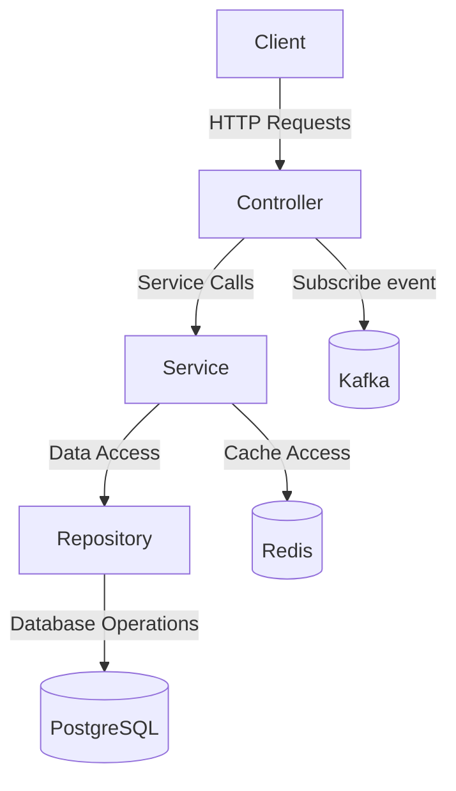
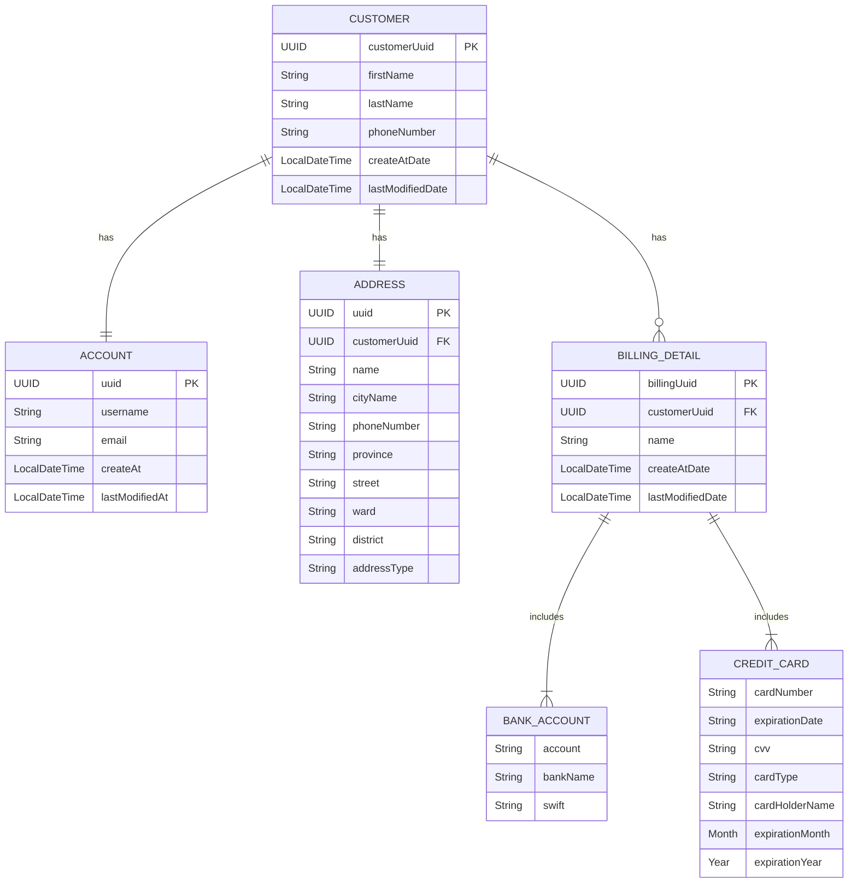
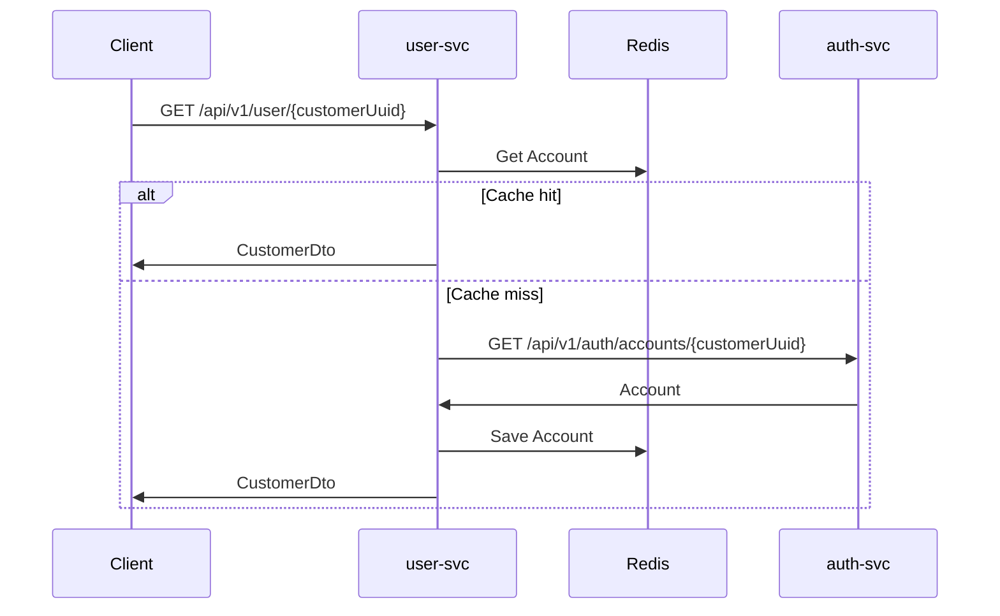
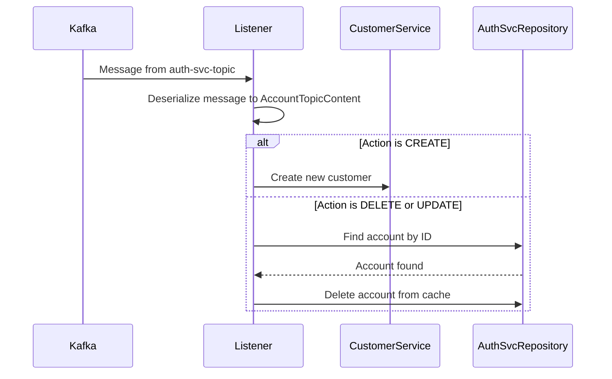

# Project Overview
The `user-svc` is a Spring Boot application that provides REST APIs for managing user data. It uses various technologies such as Spring Data JPA, Spring Security, Kafka, Redis, and more to offer a robust and scalable solution for user management.

## Technologies Used
- Java 17
- Spring Boot 2023.0.2
- Spring Data JPA 2023.0.2
- Spring Security 6.3.2
- PostgreSQL 42.7.3
- Redis
- Kafka
- OAuth2
- OpenTelemetry 1.33.5
- Prometheus
- OkHttp 5.0.0-alpha.12
- Springdoc OpenAPI 2.6.0
- MapStruct 1.5.5.Final
- Lombok
- H2 Database
- JUnit Platform Suite 1.11.0-M1

## Architecture Description
The project follows a layered architecture with controllers, services, and repositories. It uses Spring Boot for building the application, Spring Data JPA for database interactions, and Spring Security for securing the APIs.

## Entity-Relationship Diagram (ERD) with Column Details

## Common API Flow Diagrams
The API flow diagrams illustrate the interactions between different components for various API endpoints.

### Get Current Customer Details

## Kafka Listener
The project uses Kafka to listen to events from the `auth-svc-topic`. The `Listener` class is responsible for handling these events. It processes messages based on the action type (CREATE, UPDATE, DELETE) specified in the `AccountTopicContent`.

### Listener Details
- **CREATE**: When a CREATE action is received, a new customer is created in the database using the `CustomerService`.
- **DELETE/UPDATE**: For DELETE or UPDATE actions, the account is removed from the cache using the `AuthSvcRepository`.

### Kafka Configuration
- The `KafkaConfiguration` class sets up error handling for Kafka listeners using a `DefaultErrorHandler` and a `DeadLetterPublishingRecoverer` to ensure robust message processing.

This setup allows the application to efficiently handle account-related events and maintain data consistency between the database and cache.

## Kafka Listener Flow

The project uses Kafka to handle events related to account actions. Below is a description of the Kafka listener and handler flow using a mermaid diagram:

### Listener and Handler Flow

This setup allows the application to efficiently handle account-related events and maintain data consistency between the database and cache.

## Setup and Running Instructions
1. **Install Java 17:** Download and install Java 17 JDK from the official website.
2. **Install PostgreSQL:** Download and install PostgreSQL from the official website.
3. **Install Redis:** Download and install Redis from the official website.
4. **Install Kafka:** Download and install Kafka from the official website.
5. **Install Maven:** Download and install Maven from the official website.
6. **Clone the repository:** `git clone [repository url]`
7. **Configure the application:**
    - Update the database configuration in `src/main/resources/application.yml`
    - Update the Redis configuration in `src/main/resources/application.yml`
    - Update the Kafka configuration in `src/main/resources/application.yml`
    - Update the OAuth2 configuration in `src/main/resources/application.yml`
8. **Build the application:** `mvn clean install`

## Testing Information
- The project includes unit tests for service classes and integration tests for controllers.
- Test data is stored in the `src/test/resources` directory.
- The integration tests use an embedded H2 database.

## Deployment
- No deployment information provided.

## Contributing
- Guidelines for contributing to the project will be added here.

## License
- License information will be added here.
