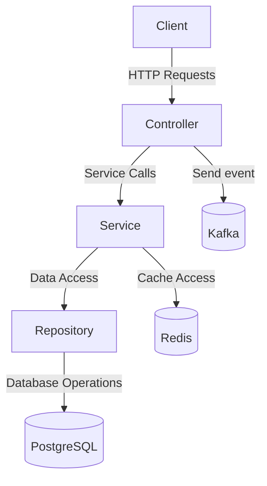
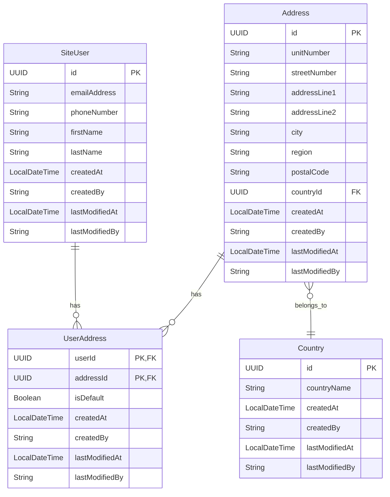

# Project Overview
The `user-svc` is a Spring Boot application that provides REST APIs for managing user data. It uses various technologies such as Spring Data JPA, Spring Security, Kafka, Redis, and more to offer a robust and scalable solution for user management.

## Architecture Description
The project follows a layered architecture with controllers, services, and repositories. It uses Spring Boot for building the application, Spring Data JPA for database interactions, and Spring Security for securing the APIs.

## Entity-Relationship Diagram (ERD) with Column Details

## Common API Flow Diagrams
The API flow diagrams illustrate the interactions between different components for various API endpoints.

